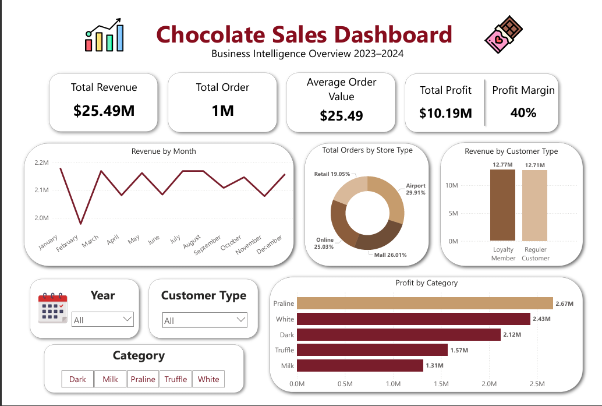

# 🍫 Chocolate Sales BI Dashboard

## 📌 Overview

This project focuses on analyzing chocolate sales performance from 2023–2024 using SQL, Python, and Power BI. The dataset consists of transactional sales data, product information, customer data, store details, and calendar tables.

The main goal of this project is to build an interactive Business Intelligence dashboard that can provide insights related to:

* sales performance
* profitability
* customer behavior
* store performance
* business trends over time

The project covers the full analytics workflow starting from data integration, preprocessing, feature engineering, and dashboard visualization.

---

# 🛠️ Tools Used

* Python (Pandas, NumPy)
* SQLite (SQL Query)
* Power BI
* Jupyter Notebook

---

# 📂 Dataset

Dataset source:

Kaggle — Chocolate Sales Dataset 2023–2024:
https://www.kaggle.com/datasets/ssssws/chocolate-sales-dataset-2023-2024

Tables used in this project:

* Sales
* Products
* Stores
* Customers
* Calendar

---

# ⚙️ Project Workflow

## 1. Data Integration

All tables were merged using SQL queries executed directly inside Python with SQLite.

The join process combines:

* sales transactions
* product information
* customer data
* store details
* calendar information

into one master dataset.

---

## 2. Data Cleaning

Several preprocessing steps were performed before visualization:

### Missing Values

Missing values were only found in the `products` table.

Handling strategy:

* categorical columns → filled with `Unknown`
* numerical columns → filled using median values

### Data Type Adjustment

Several numerical columns were converted into appropriate decimal formats before being imported into Power BI.

---

## 3. Feature Engineering

Additional features were created to improve analysis and visualization.

### Age Group

Customer age was grouped into categories:

* 18–24
* 25–34
* 35–44
* 45–54
* 55–64
* 65+

### Profit Margin

Profit margin feature was created using:

```python
profit_margin = profit / revenue
```

### Quarter Feature

Quarter values were generated from transaction month.

### Customer Type

Binary loyalty values were mapped into:

* Loyalty Member
* Regular Customer

---

# 📊 Dashboard Features

The Power BI dashboard contains several business-focused visualizations.

## KPI Cards

* Total Revenue
* Total Profit
* Profit Margin
* Total Orders
* Average Order Value (AOV)

## Visualizations

* Revenue by Month
* Profit by Category
* Orders by Store Type
* Revenue by Customer Type

## Interactive Filters

* Year
* Category
* Store Type

---

# 🔍 Key Insights

* Praline products generated the highest profit among all categories.
* Airport stores contributed the largest share of orders.
* Revenue remained relatively stable throughout the observed period.
* Loyalty members generated revenue comparable to regular customers.
* Profit margins stayed relatively consistent across filters, indicating stable pricing and cost management.

---

# 🖼️ Dashboard Preview



---

# 📁 Repository Structure

```text
chocolate-sales-bi-dashboard/
│
├── images/
│   └── Dashboard_preview.png
│
├── python/
│   └── main.ipynb
│
└── README.md
```

---

# 📂 Additional Files

- 📊 Power BI Dashboard (.pbix)  
  https://drive.google.com/file/d/1f83zxIRthoeWtz1Q5xI02YlcQAT69Sah/view?usp=sharing

- 🗂️ Raw Dataset (.zip)  
  https://drive.google.com/file/d/1hGkYFluY7kDFsb-d0dWSJEQp4Y-4DrXL/view?usp=sharing

- 🧹 Cleaned Master Dataset (.csv)  
  https://drive.google.com/file/d/1coRxEBD6UmVUULpCoxymxshTCWsaC4jw/view?usp=sharing

---
  
# 🚀 Conclusion

This project demonstrates an end-to-end Business Intelligence workflow starting from raw CSV datasets, SQL integration, preprocessing with Python, feature engineering, and interactive dashboard development using Power BI.

The dashboard helps provide insights related to sales performance, profitability, customer segmentation, and store contribution.

---
# 👤 Author

**Muhammad Doni Rizqi Fadhilah**

Business Intelligence & Data Analytics Portfolio Project

🔗 LinkedIn: 
https://www.linkedin.com/in/muhammad-doni-rizqi-fadhilah-230662309/
